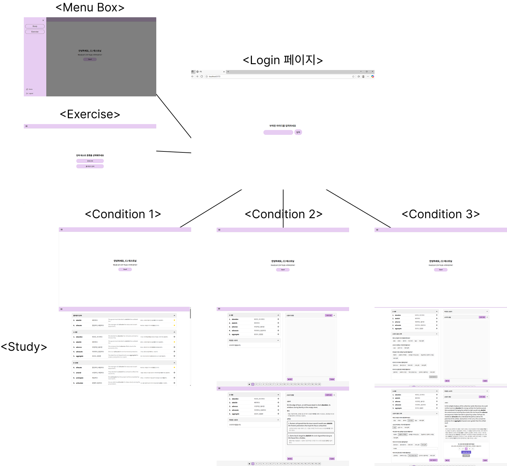
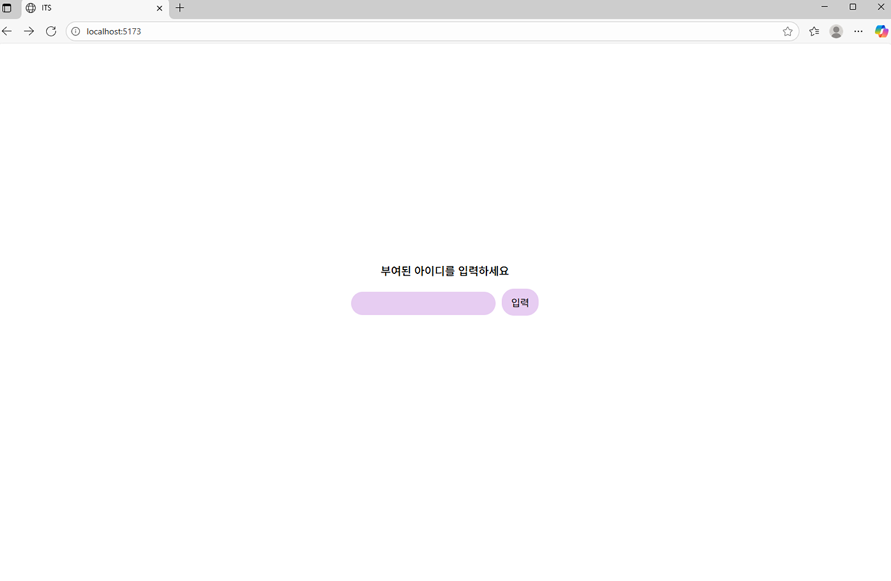
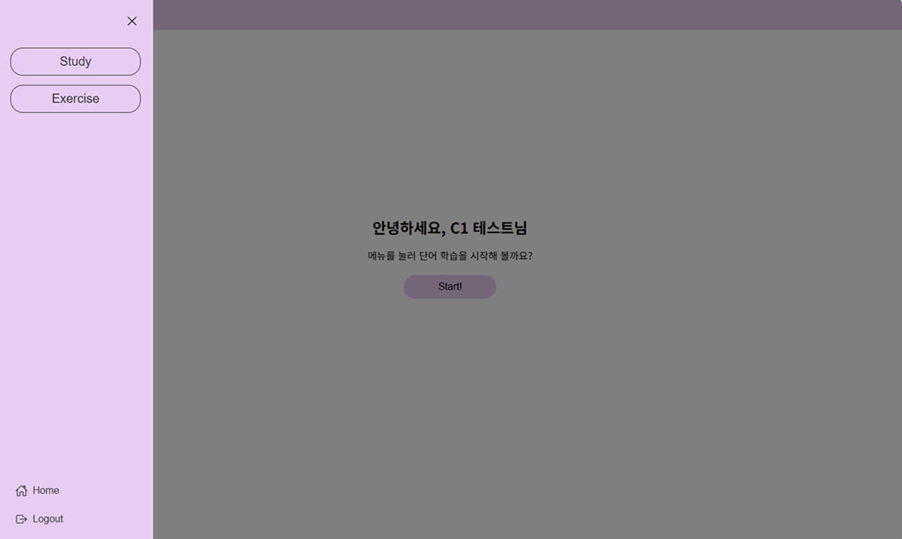
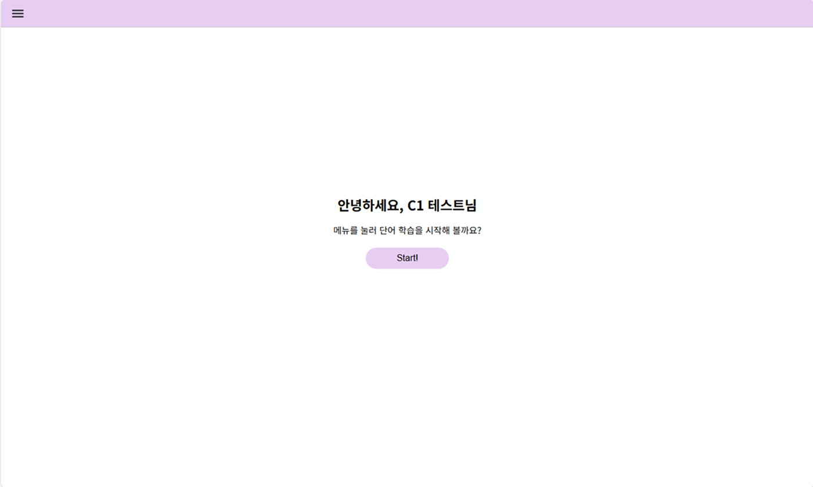
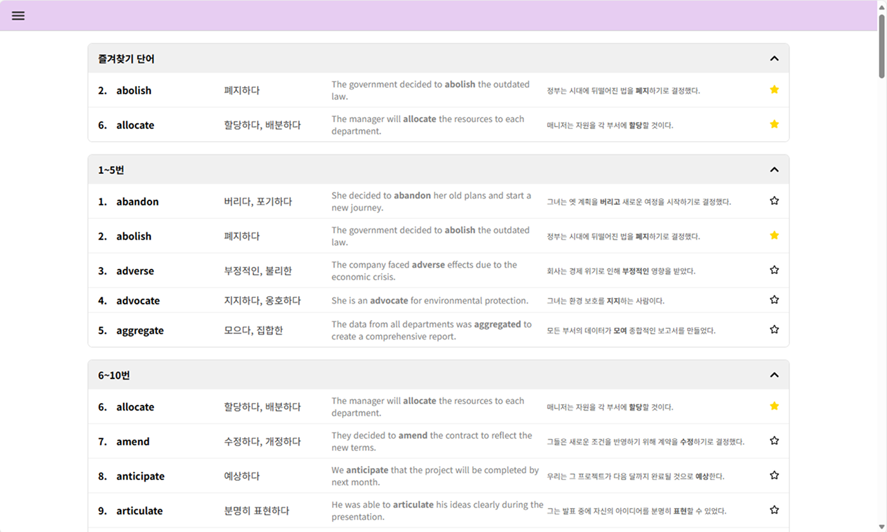
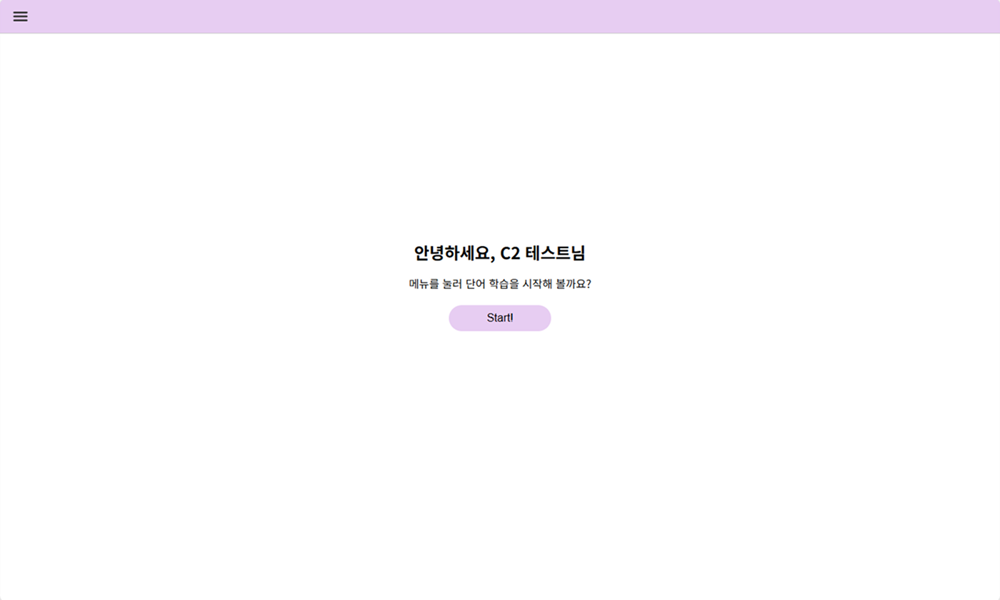
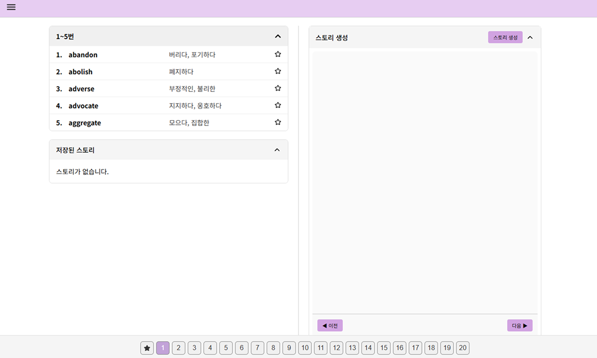
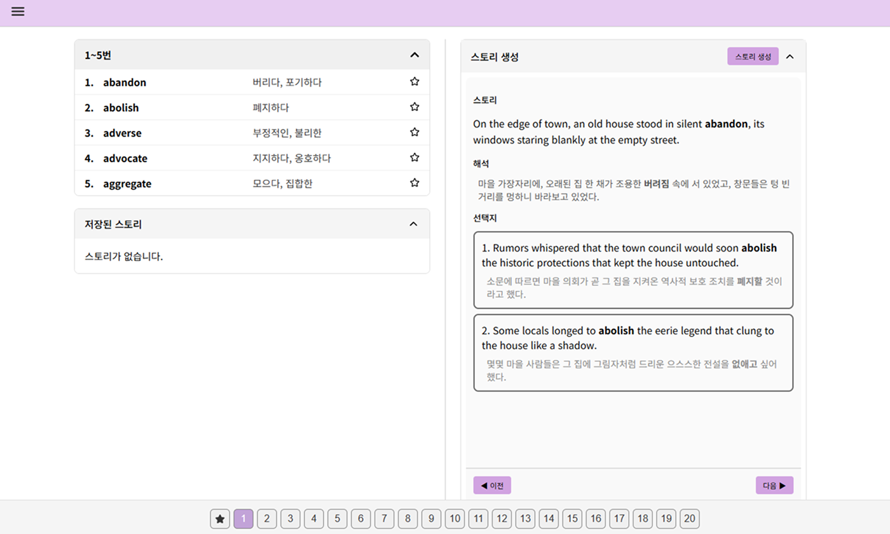
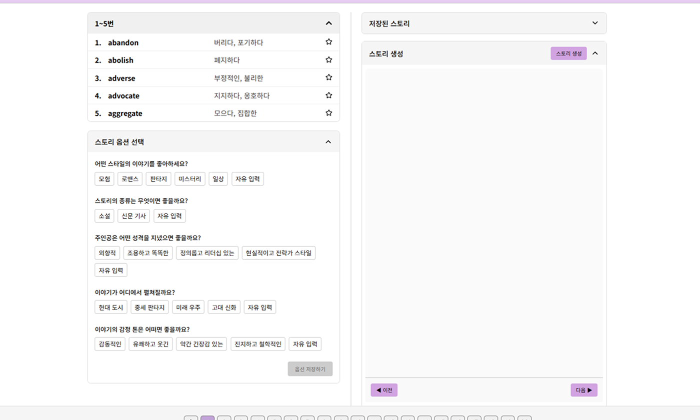
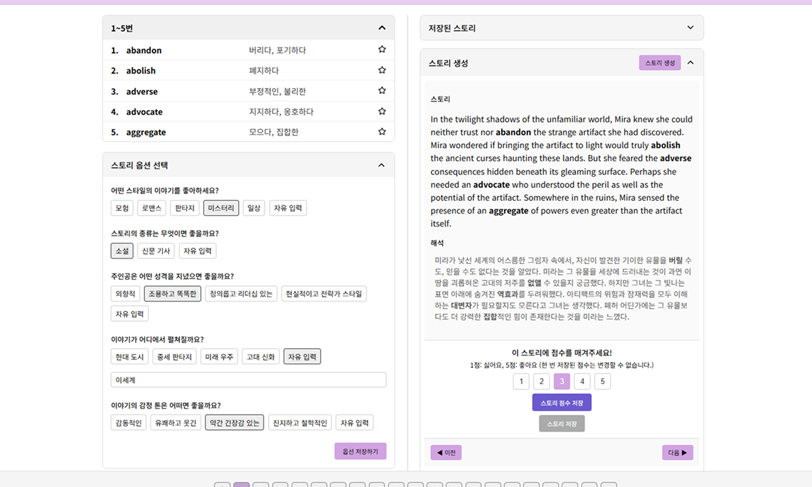

# ITS Interface Preview

> 이 저장소는 ITS 연구용 데이터 수집 인터페이스의 **UI 화면 및 기능 소개**를 목적으로 사용됩니다.  
---

## 프로젝트 개요
ITS(지능형 튜터링 시스템) 연구에서 사용된 사용자 인터페이스(UI) 미리보기입니다.  
실제 인터페이스와 동일한 **화면 구성, 주요 기능 흐름, 디자인 컨셉**을 보여줍니다.

---

## 인터페이스 소개

### 1. Condition 별로 구성된 영단어 학습 환경
- C1: 일반적인 토익 단어장과 같이 영단어 - 뜻 - 예문 의 구성으로 학습
- C2: Random Storybased Learning 을 통한 영단어 학습
- C3: Personalized Storybased Learning을 통한 영단어 학습

### 2. 구현 기술
- Python, TypeScript, Open API
- 백엔드(FastAPI + MongoDB)
- 프론트엔드(React + Vite)

### 3. 실험 참여자 활동 데이터 수집
- 각 Condition 마다 실험 참여자의 상호작용, 접속 시간 등의 연구에 필요한 데이터 자동 수집 기능

---

## UI 전체 구조

| UI_Structure |
|----------------|
|  |

---

## UI 설계

| 로그인 화면 | 메뉴 |
|----------------|----------------|
|  |  |

| C1_Home | C1_Study |
|----------------|----------------|
|  |  |

| C2_Home | C2_Study | C2_Study_2 |
|----------------|----------------|----------------|
|  |  |  |

| C3_Home | C3_Study | C3_Study_2|
|----------------|----------------|----------------|
|  |  |  |

---

## 참고 사항
- 이 저장소에는 **소스 코드, 데이터베이스, API 키 등의 정보는 포함되지 않습니다.**

---

## 작성자 소개
정승일 (Jung Seungil)

GitHub: github.com/Biotis

Email: rhjung2001@gmail.com

--- 

## 문의
궁금한 점이 있으시면 이메일로 편하게 연락 주세요.

---
