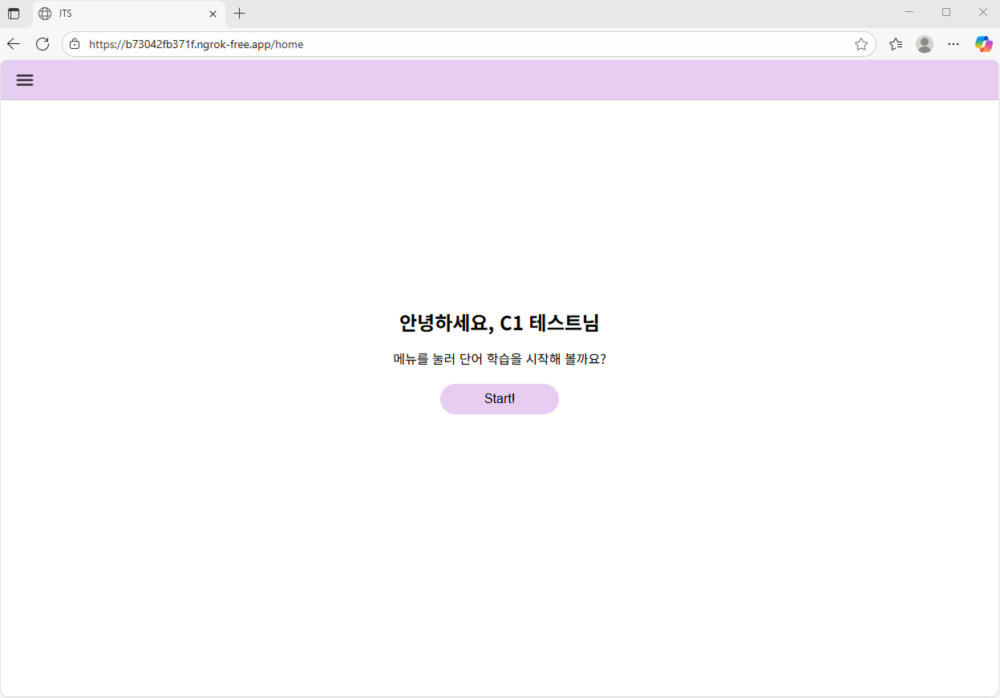
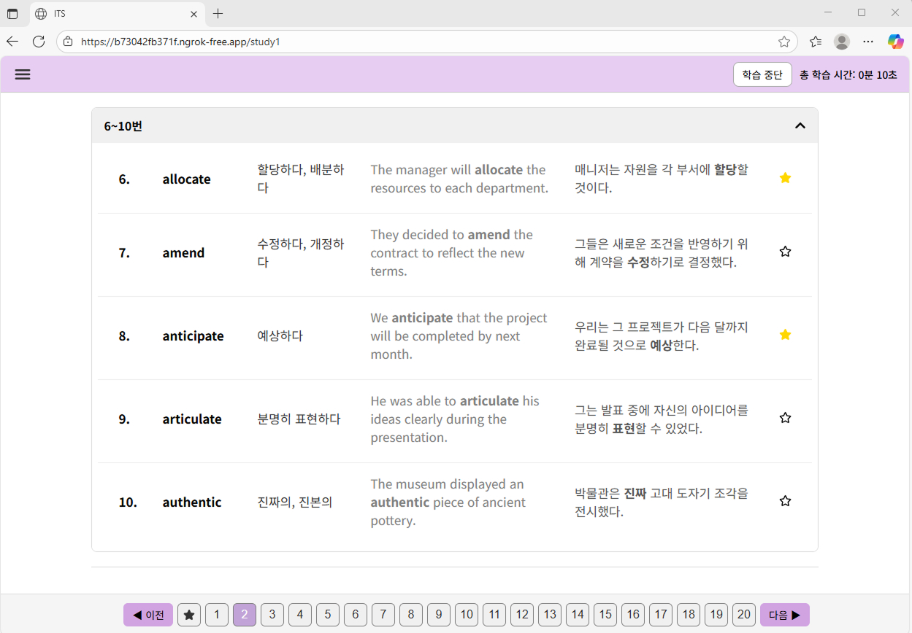

# ITS Interface Preview

> 이 저장소는 ITS 연구용 데이터 수집 인터페이스의 **UI 화면 및 기능 소개**를 목적으로 사용됩니다.  
---

## 프로젝트 개요
ITS(지능형 튜터링 시스템) 연구에서 사용된 사용자 인터페이스(UI) 미리보기입니다.  
실제 인터페이스와 동일한 **화면 구성, 주요 기능 흐름, 디자인 컨셉**을 보여줍니다.

---

## 인터페이스 소개

### 1. Condition별 영단어 학습 환경 설계

이 인터페이스는 지능형 튜터링 시스템(ITS) 연구의 실험용 학습 도구로, 연구 참여자가 조건별로 다른 방식의 단어 학습을 수행하도록 설계되었습니다.
각 Condition은 학습 형태와 콘텐츠 생성 방식이 다르며, 연구 목적에 맞춰 아래와 같이 구성되었습니다.

Condition 1 (C1): 단어, 뜻, 예문이 고정된 기본 단어 학습 환경
(토익 단어장과 유사한 전통적인 학습 방식)

Condition 2 (C2): GPT API를 활용하여 무작위 주제의 스토리 속에서 단어를 학습하는 환경
(Random Story-based Learning)

Condition 3 (C3): 사용자가 주제·배경·상황을 직접 선택하면, 그 설정을 반영해 GPT가 개인화된 스토리를 생성하는 환경
(Personalized Story-based Learning)

C2와 C3는 스토리 진행 과정에서 사용자의 선택에 따라 분기되며, 학습 몰입도를 높이기 위해 자연스럽게 이어지는 내러티브 구조를 구현했습니다.

### 2. 구현 기술
인터페이스: FastAPI + MongoDB 기반의 백엔드와 React(Vite) 기반의 프론트엔드로 개발했으며, GPT API를 사용해 스토리 기반 학습 기능을 구현했습니다.

백엔드: FastAPI로 Fast API 설계, MongoDB로 사용자 활동 로그 저장 및 관리

프론트엔드: React(Vite) 기반 UI, Condition별 화면 전환 및 학습 플로우 구현

### 3. 실험 참여자 활동 데이터 수집

연구에 필요한 사용자 활동 데이터는 Condition별 MongoDB Collection에 구조화하여 저장했습니다.
수집되는 데이터는 다음과 같습니다.

피험자 정보 데이터,
학습 세션 로그 데이터,
Story_Setting 데이터,
상호작용 로그 데이터({
  generate_count	스토리 생성 버튼 클릭 횟수,
  choice_selected_count	스토리 분기 선택 횟수,
  submit_score_count	스토리 평가 제출 횟수,
  save_count	스토리 저장 횟수,
  favorite_add_count	즐겨찾기 추가 횟수,
  favorite_remove_count	즐겨찾기 제거 횟수,
  option_select_count	스토리 옵션 선택 횟수,
  option_save_count	스토리 옵션 저장 횟수,
  page_nav_count	페이지 이동 횟수 
  ... })

등 다양한 피험자 활동 로그 데이터가 수집됩니다.

---

## UI 전체 구조

| UI_Structure |
|----------------|
|  |

---

## UI 설계

| 로그인 화면 |
|----------------|
|  |

| C1_Home | C1_Study |
|----------------|----------------|
|  |  |  |

| C2_Home | C2_Study | C2_Study_2 |
|----------------|----------------|----------------|
|  |  |  |

| C3_Home | C3_Study | C3_Study_2|
|----------------|----------------|----------------|
|  |  |  |

| Exercise_Home | all_words_exercise | bookmarked_words_exercise | Exercise_Answer|
|----------------|----------------|----------------|----------------|
|  |  |  |  |

---

## Demo Video

| Condition 1 |

https://github.com/user-attachments/assets/d3d2c841-916f-483d-861d-b4eeb4a77e47

| Condition 2 |

https://github.com/user-attachments/assets/af1c5504-9163-4fe9-bf8b-845ea96984ea

| Condition 3 |

https://github.com/user-attachments/assets/920634f5-0d5d-4f0c-bc40-710565b45bac

---

## 참고 사항

- 이 저장소에는 **소스 코드, 데이터베이스, API 키 등의 정보는 포함되지 않습니다.**
- 현재 프로젝트는 연구 진행 중이므로, 내부 리소스는 공개하지 않았습니다.
- 대신 화면 구성과 주요 기능 흐름을 이미지 및 영상 형태로 제공하여, 전체적인 구조와 동작을 이해할 수 있도록 구성하였습니다.

---

## 작성자 소개

정승일 (Jung Seungil)

Email: rhjung2001@gmail.com

--- 

## 문의

궁금한 점이 있으시면 이메일로 편하게 연락 주세요.

---
